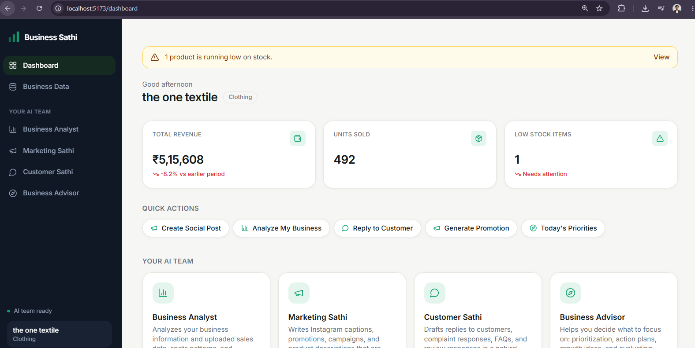
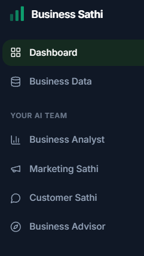

Business Sathi

Business Sathi is a local-first, AI-powered business intelligence application designed to help small-business owners understand business performance, monitor inventory, and receive contextual business recommendations through a team of specialized AI assistants.

The application combines deterministic business analytics with locally hosted AI. Business data is processed by the application to calculate measurable metrics such as revenue, units sold, best-selling products, category performance, inventory levels, and basic trends. These calculated results are then provided to Llama 3.2 through Ollama for interpretation, reporting, and recommendations.

Business Sathi is currently developed as a local MVP and portfolio project, with an emphasis on full-stack development, local AI integration, business analytics, product design, and practical automation.

## Overview

Small businesses often manage sales, inventory, and operational information across spreadsheets, invoices, and disconnected tools. This makes it difficult to quickly understand what is performing well, which products require attention, and what actions should be considered next.

Business Sathi provides a single interface where a business owner can maintain basic business context, interact with specialized AI assistants, upload business data, review calculated analytics, identify low-stock products, and generate AI-assisted reports and recommendations.

The system is designed around the principle that numerical business metrics should be calculated deterministically by application logic rather than generated by an AI model. The AI layer is therefore primarily responsible for interpreting available business information and communicating useful insights.

## Core Capabilities

### AI Business Assistants

Business Sathi provides four specialized assistants: Business Analyst, Marketing Sathi, Customer Sathi, and Business Advisor. Each assistant has its own system prompt and receives relevant business context automatically. This allows the assistants to provide responses focused on different areas of business operations rather than behaving as a single generic chatbot.

The application uses Ollama with Llama 3.2 for local AI inference. Conversations and messages are persisted using SQLite, allowing the local application to retain conversation history.

### Business Intelligence

Business owners can upload CSV files containing business data. The application performs flexible column detection for common business fields such as product, category, quantity, revenue, price, stock, and date.

The application calculates business metrics independently of the language model. These include total revenue, total units sold, best-selling products, sales by category, low-stock products, and basic revenue trends.

When both quantity and price are available, revenue is calculated as:

```text
Revenue = Quantity × Price

This keeps numerical calculations deterministic and prevents the language model from being responsible for calculating core business figures.

AI Reports and Recommendations

Calculated business metrics can be provided to Llama 3.2 through Ollama to generate business reports and recommendations.

The weekly report summarizes available business performance and provides interpretations based on the calculated data. The suggestions interface provides recommendations based on business information and uploaded analytics.

AI-generated recommendations are intended to support decision-making and should be reviewed by the business owner before being acted upon.

Inventory Monitoring

Business Sathi provides low-stock detection based on a configurable per-business threshold. Products whose available stock falls below the configured threshold can be surfaced through the Business Data interface.

Optional SMTP-based email notifications are supported through Nodemailer. Email functionality is not required for the core application and the application continues to operate when SMTP configuration is not provided.

Product Interface

Milestone 3 introduced a complete UI/UX refinement across the application. The interface includes persistent navigation, responsive mobile navigation, a consistent design system, refined dashboard cards, KPI displays, business-data visualizations, improved CSV upload interactions, enhanced assistant conversations, onboarding improvements, and dedicated loading, empty, success, and error states.

The visual design uses an emerald-based accent system, consistent spacing, reusable card and badge patterns, subtle borders and shadows, responsive layouts, and visible focus states. The interface was designed specifically around the existing Business Sathi functionality rather than reproducing a generic dashboard template.

Application Architecture
                         Business Sathi
                               |
             +-----------------+-----------------+
             |                                   |
        React Frontend                     Express Backend
             |                                   |
       +-----+------+                    +-------+-------+
       |            |                    |       |       |
   Dashboard    AI Team              SQLite  Analytics  Ollama
       |            |                    |       |       |
       |         Chat                  Data    Metrics  Llama 3.2
       |            |                    |       |
       +------------+--------------------+-------+

The frontend is implemented with React and Vite and communicates with the Node.js and Express backend through API routes. The backend manages business context, conversations, business data, analytics, reports, suggestions, and communication with Ollama.

SQLite provides local persistence for business information, conversations, messages, reports, and related application data.

Ollama provides the local inference layer for Llama 3.2. This allows the core AI functionality to operate without requiring a hosted language-model API.

Technology Stack
Frontend
React.js
Vite
Tailwind CSS
JavaScript
SVG-based data visualizations
Backend
Node.js
Express.js
SQLite
JavaScript
Artificial Intelligence
Ollama
Llama 3.2
Data Processing and Automation
CSV parsing
Deterministic JavaScript analytics
Nodemailer
SMTP
Project Structure
business-sathi/
|
├── client/
|   ├── src/
|   |   ├── assistants/
|   |   ├── components/
|   |   ├── hooks/
|   |   ├── pages/
|   |   ├── services/
|   |   └── utils/
|   └── package.json
|
├── server/
|   ├── src/
|   |   ├── assistants/
|   |   ├── config/
|   |   ├── db/
|   |   ├── routes/
|   |   └── services/
|   └── package.json
|
├── docs/
|   └── images/
|
├── .gitignore
└── README.md
Local Setup

Business Sathi currently runs locally and requires Node.js, npm, and Ollama.

1. Install and prepare Ollama

Verify that Ollama is available:

ollama list

The llama3.2 model should be available. If it is not installed, run:

ollama pull llama3.2
2. Configure the Backend

Open a terminal in the project directory and run:

cd server
npm install

Create the local environment file:

copy .env.example .env

Start the backend:

npm run dev

The backend runs on:

http://localhost:4000
3. Configure the Frontend

Open a second terminal:

cd client
npm install

Create the local environment file:

copy .env.example .env

Start the frontend:

npm run dev

The frontend normally runs on:

http://localhost:5173

Open the frontend address in a browser.

Environment Configuration

The backend uses environment variables for local configuration.

Example server configuration:

PORT=4000
OLLAMA_BASE_URL=http://localhost:11434
OLLAMA_MODEL=llama3.2
DB_PATH=./data/business-sathi.db
LOW_STOCK_THRESHOLD=5

Email alerts are optional. To enable SMTP-based low-stock notifications, configure:

SMTP_HOST=smtp.yourprovider.com
SMTP_PORT=587
SMTP_USER=you@yourdomain.com
SMTP_PASS=your-password-or-app-password
SMTP_FROM=you@yourdomain.com
ALERT_EMAIL_TO=owner@yourbusiness.com

Actual .env files must remain local and must never be committed to the repository.

Verification

After starting the backend, the Ollama health endpoint can be checked at:

http://localhost:4000/api/health/ollama

A healthy response should indicate that Ollama is available and that the configured model exists.

A basic application verification flow is:

Complete business onboarding.
Open the dashboard.
Open one of the four AI assistants.
Send a test message.
Open Business Data.
Upload a CSV containing supported business fields.
Verify the calculated metrics.
Review low-stock products.
Generate an AI report.
Generate AI business suggestions.
Screenshots


The first milestone established the core Business Sathi application. It introduced business onboarding, the dashboard, business context, four specialized AI assistants, local Ollama integration, Llama 3.2 chat, conversation persistence, SQLite storage, and Ollama availability monitoring.

Milestone 2 — Business Intelligence

The second milestone added structured business-data processing and analytics. It introduced CSV upload and validation, flexible column detection, deterministic metric calculations, best-seller analysis, category analysis, low-stock detection, configurable stock thresholds, AI-generated business reports, AI-generated suggestions, and optional SMTP-based email alerts.

The milestone also established the separation between deterministic analytics and AI interpretation. Numerical business metrics are calculated by application logic before being provided to the language model.

Milestone 3 — UI/UX and Product Polish

The third milestone focused on turning the functional MVP into a more cohesive product experience. It introduced persistent navigation, responsive mobile navigation, a consistent visual system, dashboard KPI displays, SVG-based business visualizations, improved CSV upload interactions, refined assistant chat interfaces, onboarding improvements, accessibility improvements, and comprehensive loading, empty, success, and error states.

The Milestone 3 implementation intentionally preserved the existing backend architecture and functionality from Milestones 1 and 2.

Engineering Principles
Deterministic Business Calculations

Business metrics such as revenue and units sold are calculated using application logic rather than relying on generated AI output. This provides predictable numerical results and allows the AI layer to focus on interpretation.

Local-First AI

The application uses Ollama and Llama 3.2 for local inference. This allows the core AI functionality to operate without depending on a hosted language-model API.

Context-Aware Assistance

The AI assistants receive relevant business context so that responses can be more specific to the business rather than relying only on generic prompts.

Incremental Product Development

The project was developed in progressive milestones, moving from a functional core application to business intelligence capabilities and finally to a refined user experience.

Current Scope

Business Sathi is currently a local MVP and portfolio project. It is intended to demonstrate the concept and technical implementation of an AI-assisted business intelligence application rather than operate as a production SaaS platform.

The current implementation uses a single-business-per-install model and does not include production authentication, multi-user access control, cloud deployment, payment infrastructure, or production-grade notification infrastructure.

AI-generated recommendations may require human verification before business decisions are made.

The quality of business analytics depends on the structure and quality of the uploaded CSV data.

Future Scope

Potential future development includes multi-user and multi-business support, authentication and authorization, cloud deployment, advanced sales forecasting, inventory forecasting, additional data-import formats, expanded business analytics, additional specialized assistants, and production-grade notification infrastructure.

These features are outside the current MVP scope.

Project Status

Business Sathi MVP development is complete through three development milestones.

Milestone 1 — Core MVP
Milestone 2 — Business Intelligence
Milestone 3 — UI/UX and Product Polish

The current version represents a complete local MVP demonstrating full-stack application development, local LLM integration, deterministic business analytics, inventory intelligence, AI-assisted reporting, and product-focused UI/UX design.
## Screenshots

### Dashboard





### AI Team


### Business Data and Analytics


### AI Reports and Suggestions


### Assistant Workspace


Author

Advay Patil

B.Tech Information Technology

Interests include full-stack development, artificial intelligence, blockchain, product development, and business automation.